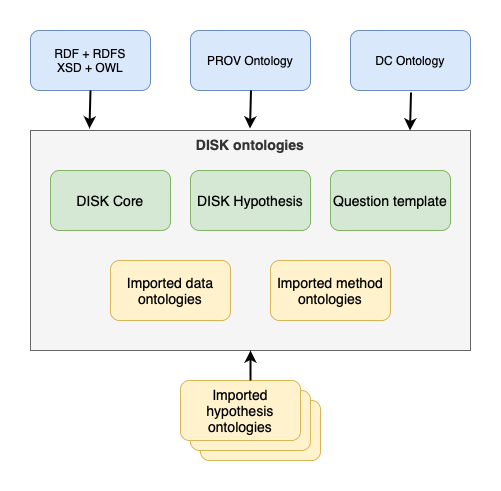

# Ontologies Overview

## What is a ontology?

Ontology is a term borrowed from philosophy that refers to the science of describing 
the kinds of entities in the world and how they are related. 
An OWL ontology may include descriptions of classes, properties and their instances.

## Disk Ontologies

The DISK system uses several ontologies to store and produce data.

The following diagram shows the ontologies used on the DISK system.

 - **On blue:** Commonly used ontologies. These ontologies contribute the vocabulary used to store metadata on the DISK system.

 - **On green:** Internal ontologies created for DISK:

    - **DISK Core:** Basic DISK definitions, such as *Hypothesis*, *Line of inquiry* and so on.
    Please check the [Disk vocabulary](http://disk-project.org/ontology/disk#) for more information.

    - **DISK Hypothesis:** Basic properties to define general hypothesis. Contains terms as `associatedWith` and so on.
    Please check the [hypothesis vocabulary](http://disk-project.org/ontology/hypothesis#) for more information.
 
    - **Question Template:** Ontology to help on the creation of hypothesis, defines *Hypothesis Questions* and how to customize them. [More info here](./question-ontology.md).

 - **On yellow:** Imported ontologies. Categorized on three types:

    - Ontologies to interact with data repositories. Defined as part of [Data Adapters](/data-adapter)

    - Ontologies to interact with workflows systems. Defined as part of [Method Adapters](/method-adapter)

    - Ontologies imported to help on the creation of *hypotheses* and *data queries*. Domain specific.

## Next steps