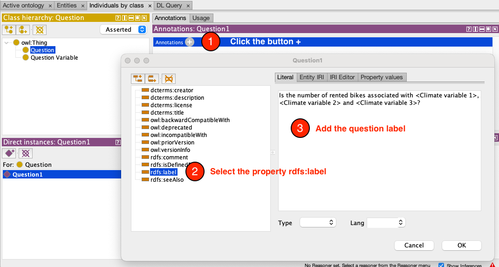
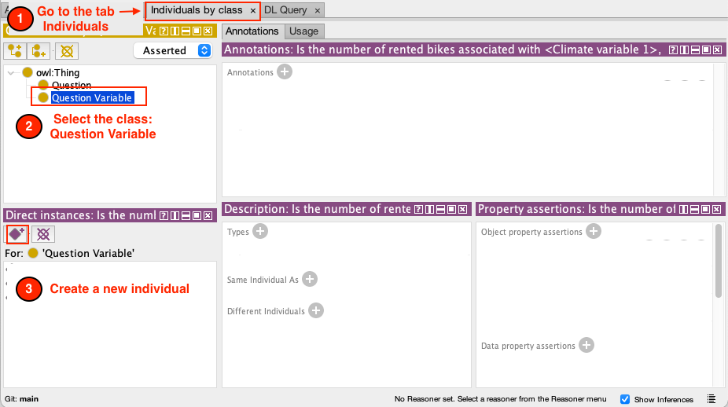
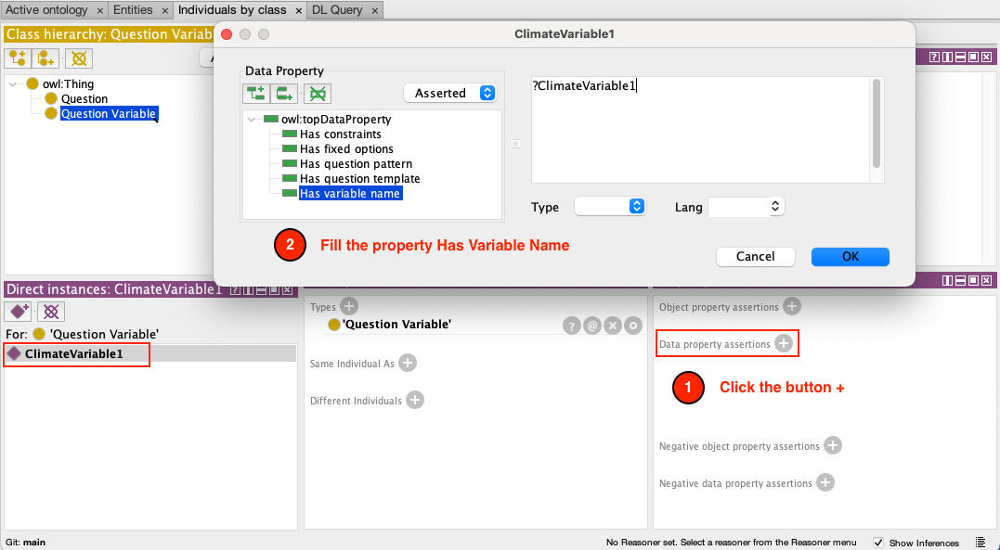
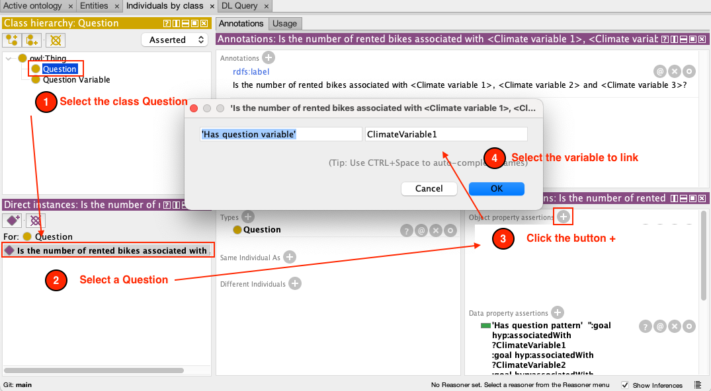
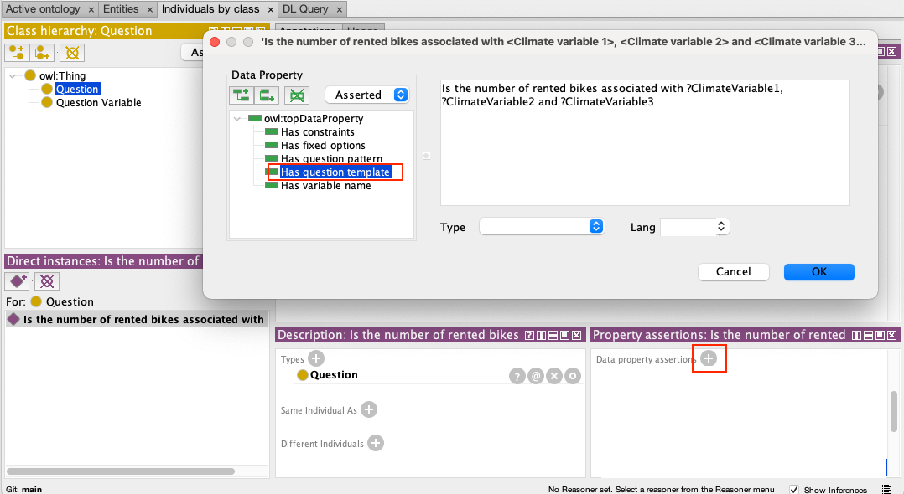

**The Scientific Questions Ontology** defines semantic templates for scientific questions, variables, options, and constraints.

In the next step, you will create a new ontology that describes the questions, variables, options, and constraints for the Bike-sharing domain

## Step 1: Installing protege

To work with ontology, we recommend using [protégé](https://protege.stanford.edu). 

Check the official instruction to learn [how to install it](http://protegeproject.github.io/protege/installation/)

## Step 2: Creating the Bike-sharing question ontology

Create a new ontology extending SQO:

1. Open Protege
2. Click the button + near the Direct Imports section. 
3. A new window will be opened
4. Paste the SQO link in the URI text field [`https://knowledgecaptureanddiscovery.github.io/QuestionOntology/release/v1.0.0/ontology.xml`](https://knowledgecaptureanddiscovery.github.io/QuestionOntology/release/v1.0.0/ontology.xml)

Great. You had created a new ontology for the Bike-rental Domain.

In the next step, you will create the questions.

## Thinking and creating the question

In this step, we will learn how to transfer your question into the ontology

Let’s suppose that we want to know `Can we predict the number of rented bikes using 3 climate variables?`

This question can be broken into three pieces:

1. **Question**: It represents our Scientific question using human language
2. **Question Variable:** It represents the *variables* used on *a question*.
3. **Question Template**: it links the Question to the previous variables

### Create the question in the ontology

In this example, we will create our **question**: 

`Can we predict the number of rented bikes using 3 climate variables?`

To create a new question

1. Go to the tab Individuals by class
2. Select the class **Question** under `owl:Thing`
3. Create a new Individual

And each question must have a label (description) which will be used to select your question in the UI.

To add the label, 

1. go to the **annotations panel** and click the + button,
2. Select the `rdfs:label` property
3. Add the description of your question. 

### Create the Question Variables

A Question Variable represents a variable used on a Question. 

To create a new question

1. Go to the tab Individuals by class
2. Select the class **QuestionVariable** under `owl:Thing`
3. Create a new Individual
4. Select a unique ID for your question variable

On the **property assertion panel**, 

1. Click on the + button to the right of **Data property assertions**.  A new window will be open
2. Fill the properties `Has variable name` and either `Has constraints` or `Has fixed options`.

Next, we need to link the question with the Variables used in it. 

1. Go to the class Question 
2. Select the question you created in step 4 
3. Click the `+`  button to the right of **Object property assertions**.
4. On the modal you must select the property `Has question variable` and the question variable to link.

### Create the Question Template

A Question Template is a text representation of the question that will create a form that the user must fill. All "question variable" names used on this template will be replaced for inputs with constraints.

To create it, we will follow the next steps

1. On the **property assertion panel**, click on the + button to the right of **Data property assertions**. 
2. In this menu, you must define values for `Has question template` and `Has Question pattern` properties. The question template will be used to generate a form allowing users further customization of questions. Each variable written on the question template will be replaced for a select input with relevant options.
The question pattern is the RDF representation of this question. Is a set of RDF triples, but you can write your question variables on it. When a user set values for a question, this RDF representation will be updated for the values selected by the user.

## Verification

You did it! Let’s do a verification of your work.

The end result should be an ontology like the following.

### Question variables

1. Go to the Individuals by class tab 
2. Click the Question class

You should see two properties called: Has Fixed Options and Has Variable Name

### Questions

1. Go to the Individuals by class tab 
2. Click the Question class

You should see:

- the three variables: ClimateVariable1, ClimateVariable2 and ClimateVariable3
- the property `Has Question Pattern` and `Has Question Template`

### Save the ontology

Click the `File` menu and `Save as` 

Save the ontology using the `OWL/XML syntax`

You did it. You can use your ontology on Disk! Please go to Using DISK documentation to learn how to use it