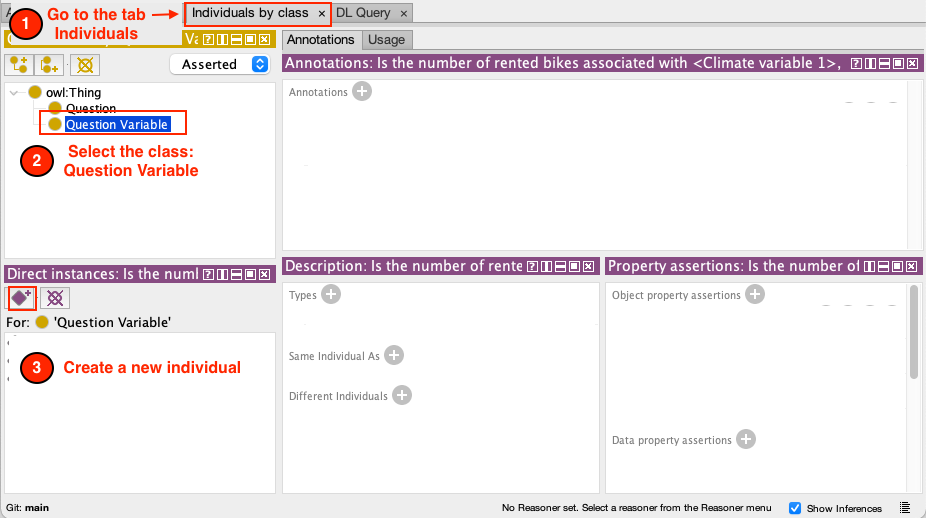
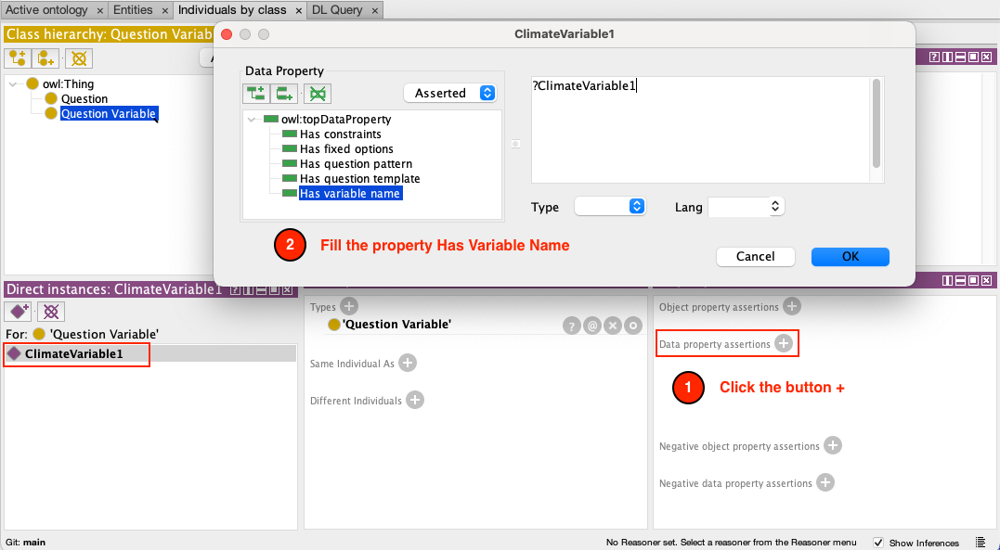
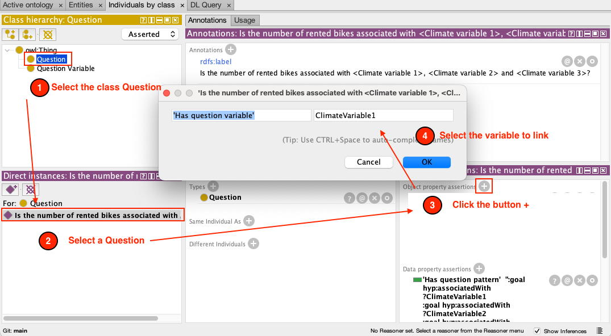

# Extending the Questions Ontology

**The Scientific Questions Ontology** defines core concepts to express scientific question templates, question variables, options, and constraints.

We show here with simple examples how to use an ontology editor to add new types of questions to DISK.  

## Setting Up an Ontology Editor

We recommend using the [Protégé](https://protege.stanford.edu) ontology editor.  Extensive documentation about how to install Protégé [is available here](http://protegeproject.github.io/protege/installation/).

Load into Protégé the DISK Scientific Questions Ontology:

1. Open Protégé
2. Click the "+" button next to the "Direct Imports" section. 
3. A new window will be opened
4. Paste the DISK Scientific Qquestions Ontology URL in the text field [`https://knowledgecaptureanddiscovery.github.io/QuestionOntology/release/v1.0.0/ontology.xml`](https://knowledgecaptureanddiscovery.github.io/QuestionOntology/release/v1.0.0/ontology.xml)

Great. You are all set to extend the ontology with new types of questions.

## Designing New Types of Question

In this step, we will learn how to transfer your question into the ontology

Suppose that our users want to predict the number of bike rentals in a bike sharing service from the weather forecast in an area.  A user may hypothesize that in New York bike rentals can be predicted from temperature, humidity, and precipitation.  But in Seattle the temperature, BP, and precipitation may be the most important factors, while in Chicago it may be temperature, wind, and precipitation.  So we wan to add a new type of question:

Is the number of rented bikes associated with ?weatherSensor1, ?weatherSensor2, and ?weatherSensor3 in ?region ?

We refer to this statement as the **Question Statement**.  Question statements contain **Question Variables**.  In this example, the question variables are ?weatherSensor1, ?weatherSensor2, ?weatherSensor3, and ?region.

To create this new type of question, we have to define 3 new items in the ontology:

1. **Question Statement**: It is the statement of the question template in English as in the example above.
2. **Question Variables:** It represents the variables used on a Question Statement.
3. **Question Template**: It is the concept that represents both the Question Statement and the Question Variables.

### Creating the Question Statement in the Ontology

In this example, we will create our question: 

`Can we predict the number of rented bikes using 3 climate variables?`

To create a new question

1. Go to the tab Individuals by class
2. Select the class **Question** under `owl:Thing`
3. Create a new Individual

And each question must have a label (description) which will be used to select your question in the UI.

To add the label, 

1. go to the **annotations panel** and click the + button,
2. Select the `rdfs:label` property
3. Add the description of your question. 

### Create the Question Variables

A Question Variable represents a variable used on a Question. 

To create a new question

1. Go to the tab Individuals by class
2. Select the class **QuestionVariable** under `owl:Thing`
3. Create a new Individual
4. Select a unique ID for your question variable

On the **property assertion panel**, 

1. Click on the + button to the right of **Data property assertions**.  A new window will be open
2. Fill the properties `Has variable name` and either `Has constraints` or `Has fixed options`.

Next, we need to link the question with the Variables used in it. 

1. Go to the class Question 
2. Select the question you created in step 4 
3. Click the `+`  button to the right of **Object property assertions**.
4. On the modal you must select the property `Has question variable` and the question variable to link.

### Create the Question Template

A Question Template is a text representation of the question that will create a form that the user must fill. All "question variable" names used on this template will be replaced for inputs with constraints.

To create it, we will follow the next steps

1. On the **property assertion panel**, click on the + button to the right of **Data property assertions**. 
2. In this menu, you must define values for `Has question template` and `Has Question pattern` properties. The question template will be used to generate a form allowing users further customization of questions. Each variable written on the question template will be replaced for a select input with relevant options.
The question pattern is the RDF representation of this question. Is a set of RDF triples, but you can write your question variables on it. When a user set values for a question, this RDF representation will be updated for the values selected by the user.

## Verification

You did it! Let’s do a verification of your work.

The end result should be an ontology like the following.

### Question variables

1. Go to the Individuals by class tab 
2. Click the Question class

You should see two properties called: Has Fixed Options and Has Variable Name

### Questions

1. Go to the Individuals by class tab 
2. Click the Question class

You should see:

- the three variables: ClimateVariable1, ClimateVariable2 and ClimateVariable3
- the property `Has Question Pattern` and `Has Question Template`

### Save the ontology

Click the `File` menu and `Save as` 

Save the ontology using the `OWL/XML syntax`

You did it. You can use your ontology on Disk! Please go to Using DISK documentation to learn how to use it
