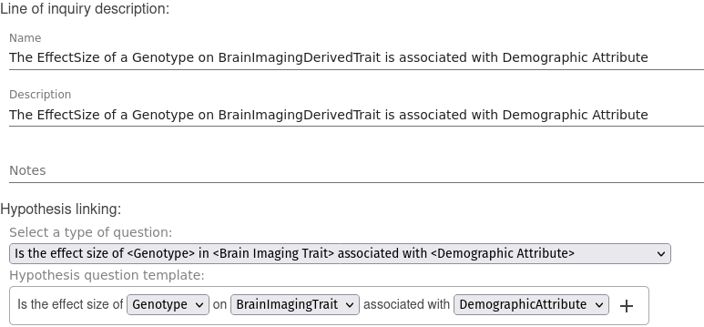

# Creating a New Line of Inquiry

You can create a new Line of Inquiry (LOI) by selecting the **Create Line of Inquiry** button.

We show first how to create an additional LOI for a question template that already exists.  There can be several LOIs to address the same question template, for example each LOI can specify an analysis for a different type of data that can answer the same question.

We will show later how to create new question templates.

## Adding Basic Documentation

You can fill the form to provide basic documentation about the LOI:

- **Line of Inquiry name**: A meaningful name for the Line of Inquiry.
- **Line of Inquiry description**: A brief overview of what the Line of Inquiry is for and how it works.

## Selecting the Question  

A Line of Inquiry is created to answer a type of question and therefore it must specify a Question Template.

You can display the question templates available by selecting the **Select Question** drop down list.
Then, select a question from the list.

### Question Variables

Note that each question template has one or more **question variables**. These question variables will be used in the **data query** that you will create for the LOI as we will explain next. 

## Next step

In the next step, you will write a data query to obtain the data needed to answer the type of question that this LOI is designed to answer.
