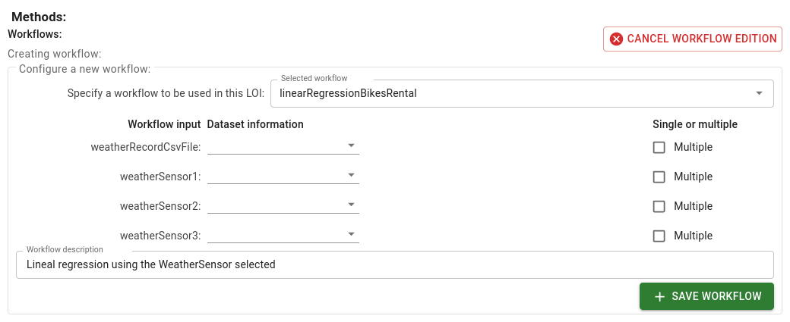

# Specifying Workflows and Meta-Workflows

To specify the workflow of the LOI, you need to select the button **Add Workflow** and select the workflow from the list of workflows.

## Passing Data to the Workflow
 
When you select a workflow, DISK displays the Workflow Inputs required to run.

For example, the following workflow requires the inputs to run:

- `?WeatherSensorCsvFile` a CSV file or multiple CSV files containing the weather data
- `?WeatherVariable1`,`?WeatherVariable2`,`?WeatherVariable3` the names of the weather variables to be used in the workflow. (e.g. temperature, wind speed or precipitation)

Next, you need to specify the values for the Workflow Inputs. To do that, click on one of the Workflow Inputs and select the LOI variable from the list of LOI variables displayed.

!!! info
        The LOI variables are obtained from the data query response and the question template.

For example, we select the following options:

- LOI variable `?WeatherSensor1` to pass as the value for the `?WeatherSensor1` Workflow Input.
- LOI variable `?WeatherSensor2` to pass as the value for the `?WeatherSensor2` Workflow Input.
- LOI variable `?WeatherSensor3` to pass as the value for the `?WeatherSensor3` Workflow Input.
- LOI variable `?WeatherRecordCsvFile` to pass as the value for the `?WeatherCsvFile` Workflow Input. Also, we select the option called **Multiple** because the LOI variable `?url` can be a CSV file or multiple CSV files.

You can also add a **Meta-Workflow** to the workflow.  A **Meta-Workflow** is a workflow that is executed before the main workflow. 

### Saving

Remember to save the Line of Inquiry.

## Next steps

You can test the LOI by creating a new Hypothesis and selecting the LOI. [See the previous section details](/user-guide/write-hypothesis).