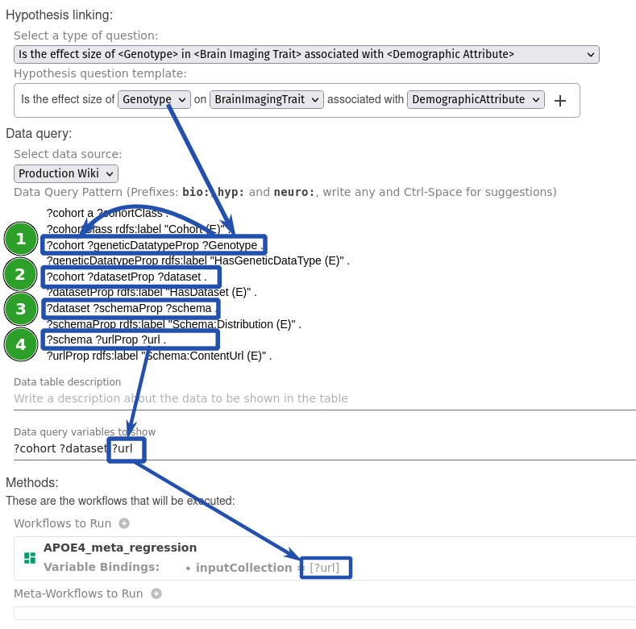

# Writing a Data Query for an LOI

A **data query** is used to obtain the data required to answer the question template of the LOI.

!!! note
    The *data query* will be executed on an external data repository that has a [data adapter](/data-adapter) that integrates it with DISK.
    The current implementation of DISK supports queries for data using `SPARQL` as the query language.  
    Developers can extend DISK to integrate new data sources and create new data adapters.

## Writing a Data Query in SPARQL

The starting point of the query are the **Question Variables** specified in the Question Template.  

You can write the query by clicking on the **Query** text area.

The next example shows a data query for neuroscience data.  The query follows several steps to obtain the data:

1. Using the Question Variable `?Genotype` to find the `?Cohort`
2. Using `?Cohort` to find the `?dataset`
3. Using `?dataset` to find the `?schema`
4. Using `?schema` to find `?url`

The query also includes at the end the **Workflow Variable: Url** that is passed as an input to the workflow of the LOI, as we describe next.

## Specifying Workflows and Meta-Workflows

## Saving

Remember to save the Line of Inquiry.

## Next steps

