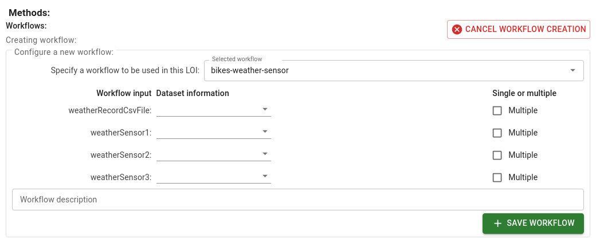

# Writing a Data Query for an LOI

A **data query** is used to obtain the data required to answer the question template of the LOI.

!!! note
    The *data query* will be executed on an external data repository that has a [data adapter](/data-adapter) that integrates it with DISK.
    The current implementation of DISK supports queries for data using `SPARQL` as the query language.  
    Developers can extend DISK to integrate new data sources and create new data adapters.

## Writing a Data Query in SPARQL

The starting point of the query are the **Question Variables** specified in the Question Template.  

You can write the query by clicking on the **Query** text area.

The next example shows a data query for neuroscience data.  The query follows several steps to obtain the data:

1. Using the Question Variable `?Genotype` to find the `?Cohort`
2. Using `?Cohort` to find the `?dataset`
3. Using `?dataset` to find the `?schema`
4. Using `?schema` to find `?url`

The query also includes at the end the **Workflow Variable: Url** that is passed as an input to the workflow of the LOI, as we describe next.

## Specifying Workflows and Meta-Workflows

To specify the workflow of the LOI, you need to select the button **Add Workflow** and select the workflow from the list of workflows.

### Passing Data to the Workflow
 
When you select a workflow, DISK displays the Workflow Inputs required to run.

For example, the following workflow requires the inputs to run:

- `?WeatherRecordCsvFile` a CSV file or multiple CSV files containing the weather data
- `?WeatherVariable1`,`?WeatherVariable2`,`?WeatherVariable3` the names of the weather variables to be used in the workflow. (e.g. temperature, wind speed or precipitation)

Next, you need to specify the values for the Workflow Inputs. To do that, click on one of the Workflow Inputs and select the LOI variable from the list of LOI variables displayed.

!!! info
        The LOI variables are obtained from the data query response and the question template.

For example, we select the following options:

- LOI variable `?ClimateVariable1` to pass as the value for the `?WeatherRecord1` Workflow Input.
- LOI variable `?ClimateVariable2` to pass as the value for the `?WeatherRecord2` Workflow Input.
- LOI variable `?ClimateVariable3` to pass as the value for the `?WeatherRecord3` Workflow Input.
- LOI variable `?url` to pass as the value for the `?WeatherCsvFile` Workflow Input. Also, we select the option called **Multiple** because the LOI variable `?url` can be a CSV file or multiple CSV files.

You can also add a **Meta-Workflow** to the workflow.  A **Meta-Workflow** is a workflow that is executed before the main workflow. 

## Saving

Remember to save the Line of Inquiry.

## Next steps

You can test the LOI by creating a new Hypothesis and selecting the LOI. [See the previous section details](/user-guide/write-hypothesis).