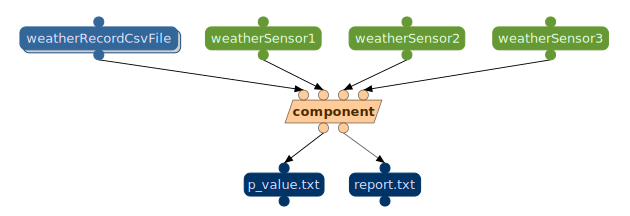

# Bikes example on Wings

In this step, we will learn how to create a workflow using Wings.

Suppose that our users want to predict the number of bike rentals in a bike sharing service from the weather forecast in an area. A user may hypothesize that in New York bike rentals can be predicted from temperature, humidity, and precipitation. But in Seattle the temperature, BP, and precipitation may be the most important factors, while in Chicago it may be temperature, wind, and precipitation. So we wan to add a new type of question:

Is the number of rented bikes associated with ?weatherSensor1, ?weatherSensor2, and ?weatherSensor3 in ?region ?

This question can be answer by a simple lineal regression and you can find the code in the following [Link](https://github.com/KnowledgeCaptureAndDiscovery/bikes_rent_example/tree/1.0.1)
The code is a simple Python script that reads the weather data from one or multiple CSV files and predicts the number of bike rentals in a given region.

## Import a WINGS domain

This section will be learn about how to create a workflow using Wings.
To do that, we have prepared a Wings domain using the previous code. 

!!! info
    Domains serve as workspaces in which you can organize your projects. Creating different domains for various tasks helps to prevent confusing components and makes elements of the workflow easier to find. Domains can be thought of as analogous to windows within a web browser and related templates are like related tabs within a window. 

To import a Wings domain, open "Manage Domain" page from the Portal Navigation Menu.

Click on "Import Domain" to import an existing domain

We can either give a pointer to an existing domain Zip file, or upload one. Here we are pointing to a domain zip file present in the wings servers. Other domains can be found here: [https://raw.githubusercontent.com/KnowledgeCaptureAndDiscovery/DISK-UI/main/docs/domains/bikes.zip](https://raw.githubusercontent.com/KnowledgeCaptureAndDiscovery/DISK-UI/main/docs/domains/bikes.zip)

## Check the Workflow component

!!! info
    Workflow component - A workflow component can be used as a step in the workflow. It is either 1) an executable software component that is encapsulated and can be directly executed, or 2) a class of software components (also called an abstract component) whose instances are executable software components. 

Go to your WINGS instance and follow the next steps:

To check the component, click on the component name.

Now this component's IO (Inputs/Outputs) can be viewed.

This component has:

- one input file (?weatherRecordCsvFile), this input expects one or multiple CSV files with the following columns: season,mnth,holiday,weekday,workingday,weathersit,temp,atemp,hum,windspeed,cnt
- three inputs parameters (?weatherSensor1, ?weatherSensor2, ?weatherSensor3) that are the weather sensors used in the prediction.
- two outputs file (?p_value, ?summary) that are the model predictions and the summary of the model.

### Check the component code

Click on the "Code" button to view the component code.

## Check the workflow

You can browse and run workflows that are pre-defined in the system. You do this by selecting "Run Workflows" under the Analysis Tab. 

In this tab, you can see the list of workflows that are available in the system and DISK or you can run them.

You will be see the example workflow created by us called: "linearRegressionBikesRental". This workflow run the component described previously.

