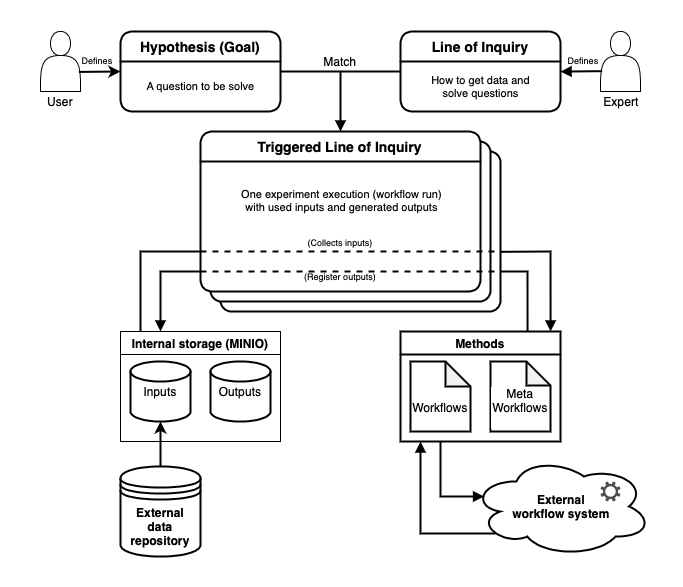

# Core Concepts in DISK

 - **Hypothesis:** A hypothesis statement is a set of assertions about entities that can be tested. A hypothesis can be tested by analyzing relevant data.
 - **Question:** A statement that represents the goal of a scientific investigation.
 - **Hypothesis or Question Template:**  A general pattern that can be instantiated to create a particular hypothesis or question.  
 - **Workflow:**  Workflows specify multi-step computations to carry out a type of data analysis.
 - **Method:** A general approach that is followed to test a hypothesis.  
 - **Line of Inquiry (LOI):** DISK represents in an LOI *how* a hypothesis will be tested through a computational experiment. An LOI specifies: 1) A hypothesis template, 2) A query to retrieve relevant data from accessible data sources in DISK, 3) One or more workflows to analyze the data retrieved from the query, and 4) A meta-workflow to combine the results of all the workflows and synthesize findings.  
 - **Triggered Line of Inquiry:** When the user specifies a hypothesis, it is matched against the hypothesis templates of all LOIs.  The matched LOI is then triggered for execition.  
 - **Provenance:** DISK records the provenance of all results so that they can be inspected and reproduced. 
 - **Metadata:** DISK accesses data sources that contain datasets that are well described with appropriate metadata that can be used in specifying queries.

The diagram below gives an overview of the differtent components of DISK and how different types of users interact with DISK.

