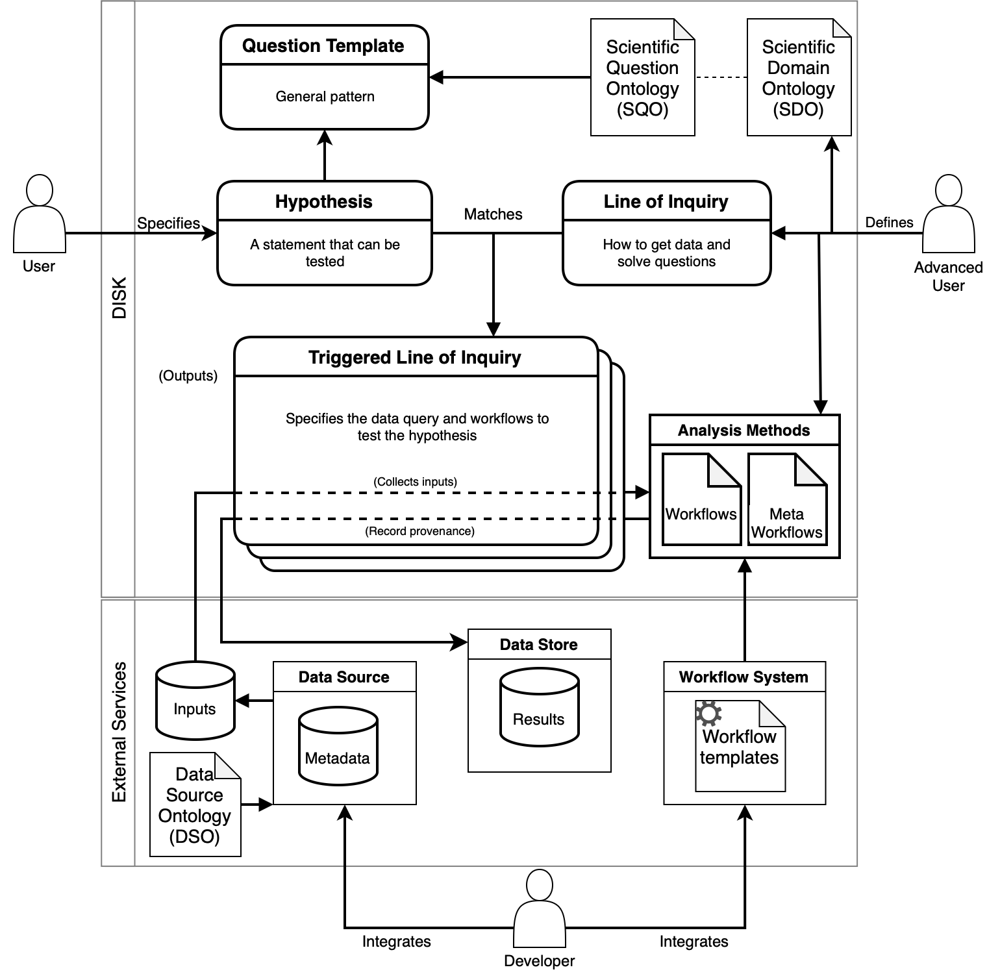

# Core Concepts in DISK

 - **Hypothesis or Goal:** A hypothesis or goal is a set of assertions about entities that can be tested. A hypothesis can be tested by analyzing relevant data, as defined on Lines of Inquiry.
 - **Question:** A statement that represents the goal of a scientific investigation.
 - **Question Template:**  A general pattern that can be instantiated to create a particular hypothesis or goal.  
 - **Workflow:**  Workflows specify multi-step computations defimed to carry out a type of data analysis.
 - **Method:** A general approach that is followed to test a hypothesis.  
 - **Line of Inquiry (LOI):** Represents *how* a hypothesis will be tested through a computational experiment. A LOI specifies: 1) A question template, 2) A query to retrieve relevant data from accessible data sources in [DISK](https://disk.isi.edu), 3) One or more workflows to analyze the data retrieved from the query, and 4) A meta-workflow to combine the results of all the workflows and synthesize findings.  
 - **Triggered Line of Inquiry:** When a Line of Inquiry finds a Hypothesis that match their query template, a new Triggered Line of Inquiry is created. TLOIs store data query results and workflow execution outputs.
 - **Provenance:** [DISK](https://disk.isi.edu) records the provenance of all results so that they can be inspected and reproduced. 
 - **Metadata:** [DISK](https://disk.isi.edu) accesses data sources that contain datasets that are well described with appropriate metadata that can be used in specifying queries.

The diagram below gives an overview of the differtent components of [DISK](https://disk.isi.edu) and how different types of users interact with [DISK](https://disk.isi.edu).

