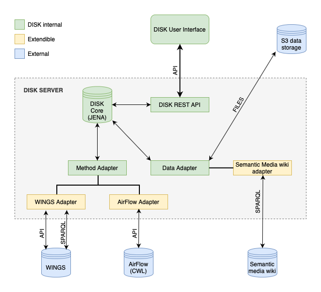

# DISK API adapters

The DISK System can obtain data from different data repositories and send runs to different workflow systems.

Each data repository must have an implemented [Data Adapter](/data-adapter) to transform his API responses to structures that DISK can recognize.
The same is true for each method provider (workflow systems), a [Method Adapter](/method-adapter) must be written to interact with the external API.

To understand how this is done we could look how the data interacts in the system.

DISK provides an abstract classes to implement both, [method adapters](method-adapter) and [data adapters](data-adapter).
Check their respective page for a detailed explanation on how to create a new adapter.

The current implementation of the DISK system includes two method adapters: [WINGS Workflow System](https://www.wings-workflows.org) adapter and [AirFlow](https://airflow.apache.org) adapter (WIP); And one data adapter: the [Semantic Media Wiki adapter](#).

## Implemented adapters

### WINGS Adapter
 - List workflows.
 - Create new executions with parameters and files.
 - Stores output files.
 - Provides a `SPARQL` endpoint and stores executions on `RDF`.

### AirFlow Adapter
 - WIP

### Semantic Media Wiki Adapter
 - Provides a `SPARQL` endpoint to search for data.
 - SMW can be configured to use the same ontologies as DISK.
 - SMW can be used to add files and metadata.