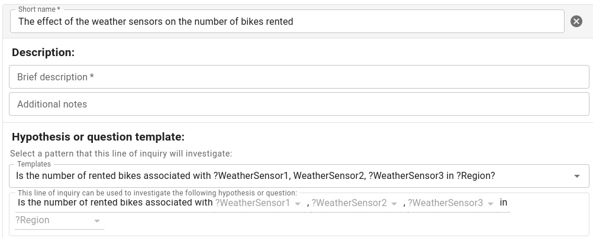

# Create Line of Inquiry

## Add basic information

You can create a Line of Inquiry by clicking on the **Create Line of Inquiry** button.

Then, you must fill the form with the following information:

- **Line of Inquiry name**: The name of the Line of Inquiry.
- **Line of Inquiry description**: A description of the Line of Inquiry.

## Select the Question  

A Line of Inquiry must be associated with a Question and the Question Variables

You can display the questions available by clicking on the **Select Question** drop down list.
Then, select a question from the list.

### Question Variables

Each question variable is going be associated with a variable in the **data source**. In other words,
the question variable is used to find the data required by the analysis.

## Next steps

In the next steps, you will write a Data Query to obtain the data required to run the analysis.