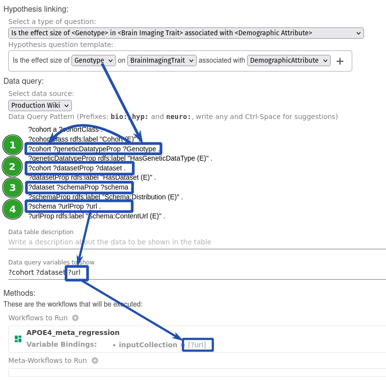

# Write the query

A **data query** is used to obtain the data required by the workflow.

!!! note
    A *data query* can be executed on multiples data repositories, as long a [data adapter](/data-adapter) is written to support it.
    The current implementation queries for data using `SPARQL` as query language.

## Creating a query using SPARQL

The starting point of the query is the **Question Variable** and the goal is to obtain the **data** required by the workflow.

You can write the query click in the **Query** text area.

### Example

From the Neuro Disk Implementation, we can see a **data query** in the following image.

The steps to obtain the data are:

1. Using the Question Variable `?Genotype` found the `?Cohort`
2. Using `?Cohort` found `?dataset`
3. Using `?dataset` found `?schema`
4. Using `?schema` found `?url`

And the ending point is the **Workflow Variable: Url**.

## Final steps

Remember to save the Line of Inquiry.