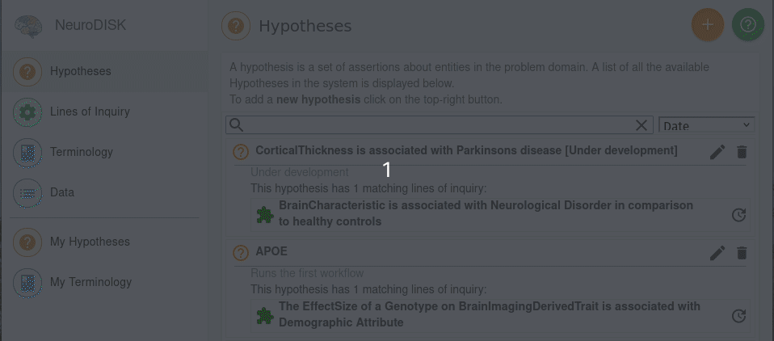
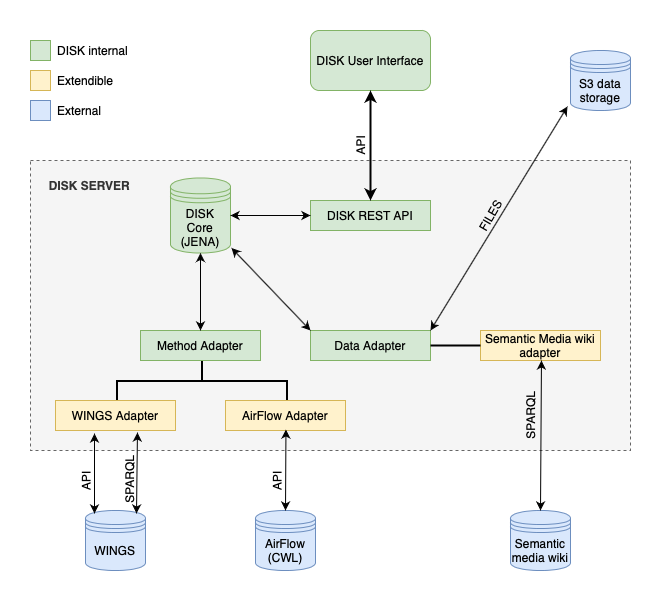

# Overview

## What is DISK?

The DISK is a system that automates the execution of scientific workflows triggered on data changes. 

## Why DISK?

Existing large repositories of
data could be continuously and systematically analyzed by
machines, updating findings and potentially making new
discoveries as new data becomes available

## Getting Started

### Quick Start

You can using DISK [here](https://disk.isi.edu).
[User documentation](user-guide/) describe how to create and test hypothesis.
Further advanced user oriented [documentation](advanced-user/) describe how to find 
data and run analysis. Additionally, Developer oriented [documentation](developer-guide/) 
is available for people interested in building third-party integrations.

## How it works

The DISK system automates the execution of scientific workflows triggered on data changes.
To do this DISK collects data from different data repositories and defines methods on different workflows systems.
User defined goals are periodically check for new data/methods available. When a method detects new data, a new workflow execution will be send.
Each experiment execution is stored with its metadata and outputs for posterior analysis.

## Architecture

DISK is implemented as a service which continuously monitors new data/methods available with existing user goals.
Furthermore, DISK System can obtain data from different data repositories and send runs to different workflow systems.
For more information about the DISK architecture, please check the [architecture](developer-guide/architecture/) page.

## Features

- Automated execution of scientific workflows triggered on data changes
- Automatic discovery of new data and methods
- Automatic execution of new workflows
- Automatic storage of experiment executions
- Automatic analysis of experiment executions
- Support for multiple data source integration using Adapter
- Support for multiple workflow engines using Adapter
- SSO for user authentication

## Development Status

DISK is being actively developed by the [Knowledge Capture and Discovery Team](https://knowledgecaptureanddiscovery.github.io/).
Our releases can be found [releases](https://github.com/KnowledgeCaptureAndDiscovery/DISK-WEB/releases).

---

## Adoptions

Organizations who have officially adopted DISK can be found [here](adoptions).