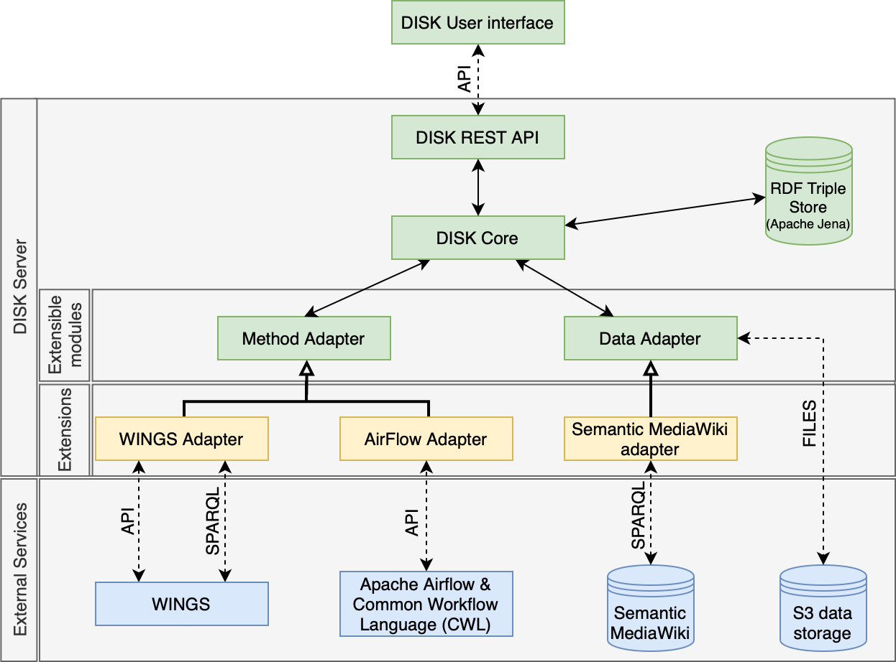

# Overview

## What is DISK

[DISK](https://disk.isi.edu) is a framework that uses AI to automate scientific data analysis to accelerate discoveries. There are many large repositories of
scientific data could be continuously and systematically analyzed by [DISK](https://disk.isi.edu), updating findings and potentially making new
discoveries as new data becomes available.

This video shows a brief overview how a new hypothesis can be specified by a user and the automation that follows.

## Getting Started

You can start to use DISK [here](https://disk.isi.edu), note that you will need to request an account.

### Target Users and Documentation

- Users: Scientists who use [DISK](https://disk.isi.edu) to specify and test hypotheses or ask questions.  Read this [documentation](user-guide/)
- Advanced Users: Scientists who understand the design of [DISK](https://disk.isi.edu) and can extend it to support new types of hypotheses and questions by defining data queries and workflows.  Here is the detailed [documentation](advanced-user/). 
- Developers: Programmers who can extend [DISK](https://disk.isi.edu) by integrating it with new data sources and new workflow systems.  There is [documentation](developer-guide/) and a GitHub repository with the code.

## How DISK Works

[DISK](https://disk.isi.edu) automatically tests hypotheses provided by a scientist.
To do this, [DISK](https://disk.isi.edu) retrieves data from existing data repositories and analyzes the data using intelligent workflows.
User-defined hypotheses are re-run when new data or methods become available. 
[DISK](https://disk.isi.edu) stores all the provenance and metadata for new results, so they can be inspected and reproduced.

### Key Features

- User interface to specify scientific hypotheses and track results
- Automated retrieval of data relevant to a given hypothesis or question
- Automated selection and execution of workflows to analyze data
- Automated recording of provenance for new results
- Support for new data source integration using Adapters
- Support for new workflow engines using Adapters
- SSO for user authentication

### Overview of DISK Architecture

For more information about the [DISK](https://disk.isi.edu) architecture, please check the [architecture](developer-guide/architecture/) page.

## Development Status

[DISK](https://disk.isi.edu) is being actively developed by the USC/ISI [Knowledge Capture and Discovery Team](https://knowledgecaptureanddiscovery.github.io/).
[DISK](https://disk.isi.edu) releases can be found [releases](https://github.com/KnowledgeCaptureAndDiscovery/[DISK](https://disk.isi.edu)-WEB/releases).

---

## Applications of DISK

We are using [DISK](https://disk.isi.edu) in several applications, more details can be found [here](adoptions).
