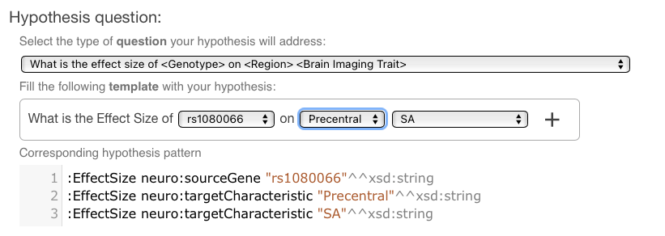

# The Question Template Ontology

The question ontology aims to help users on the creation of semantic representations for scientific questions (hypothesis).

The ontology defines the `Question` resource with the following properties:

 - `hasQuestionTemplate`: Text representation of the question. Includes `SPARQL` variable names that will be replaced for appropriate options.
 
 - `hasQuestionPattern`: `SPARQL` like pattern that defines the semantic representation of this *Question*.
 
 - `hasQuestionVariable`: list of `QuestionVariable` for this *Question*. These appear as `SPARQL` variables on the template and pattern.
 
and the `QuestionVariable` resource:
 
 - `hasVariableName`: `SPARQL` name of this variable. Is used on the question pattern and template.
 
 - `hasConstraints`: `SPARQL` query that will determine the options for this variable.
 
 - `hasFixedOptions`: list of fixed options for this variable, use this or `hasContraints`.

As each question defines a "part" of a `SPARQL` query, we can compose multiple simple questions to create complex ones.
 
## Creating Hypothesis with the Question Ontology

First, lets define a hypothesis question **HQ1**:

```
HQ1 rdf:label "Is the effect size of genotype in brain trait associated with attribute" .
HQ1 disk:hasQuestionPattern "?EffectSize neuro:sourceGene ?Genotype. \
                             ?EffectSize neuro:targetCharacteristic ?BrainImagingTrait. \
                             ?EffectSize hyp:associatedWith ?DemographicAttribute" .
HQ1 disk:hasQuestionTemplate "Is the EffectSize of ?Genotype on ?BrainImagingTrait associated with ?DemographicAttribute";

HQ1 disk:hasQuestionVariable HQ1V1 .
HQ1V1 disk:variableName "?Genotype" .
HQ1v1 disk:constraints "?Genotype a neuro:Genotype"
HQ1V1 a disk:QuestionVariable .

HQ1 disk:hasQuestionVariable HQ1V2 .
HQ1V2 disk:variableName "?BrainImagingTrait" .
HQ1V2 a neuro:BrainCharacteristic .

HQ1 disk:hasQuestionVariable HQ1V3 .
HQ1V3 disk:variableName "?DemographicAttribute" .
HQ1V3 a neuro:DemographicCharacteristic .
```

This `RDF` question will be render on the UI as follow:



The user can select questions from the list. Each question can have one or more customizable parameters.
When the user sets an option, the hypothesis pattern is updated, generating the needed RDF graph.