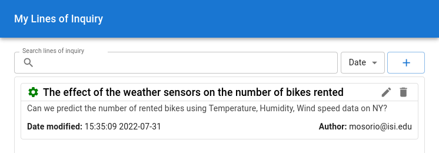

# Test hypothesis

Questions can be posed as testing a hypothesis, which would be a statement that can be supported or dismissed based on data analysis.

This document shows how DISK runs the data analysis.

## Line of inquiry (LOI)

A line of inquiry (LOI) is the mechanism that DISK use to trigger
workflows to answer questions and test the hypothesis.

!!! Info
    A line of inquiry is created by the Operator user.

## View LOIs

To view LOIs associated with a hypothesis, go to the **Hypothesis** page. LOIs are displayed below the **Hypothesis** title.

In the following image, you can see the LOIs associated with the two hypothesis

## Check results

The LOIs that match are then triggered, which results in their query being executed, then the workflows, and then the meta-workflow. 

To display the workflow executions, click on the LOI name. Then, you can see the results.

In the following image, you can see two executions associated with the LOI. The first one is using 10 files, generating 2 outputs and the p-value result is 0.838 and the second one is using 56 files, generating 2 outputs and the p-value is 0.776.

## Get the Execution narrative

Each workflow execution has a narrative. It shows the steps, and files that were used in the execution and their results.

To display the narrative,  you can click on the **Narrative** button to see the narrative.

The following image shows the execution narrative for the first LOI. The workflow triggered is the **"Bike Rental"** workflow, which was done on the **Wings** Workflow Engine using multiple csv files.

## Next steps

You can learn about the Advanced User actions.
