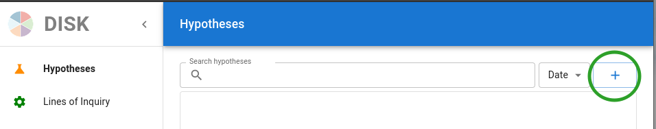
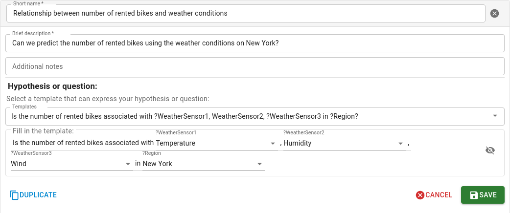
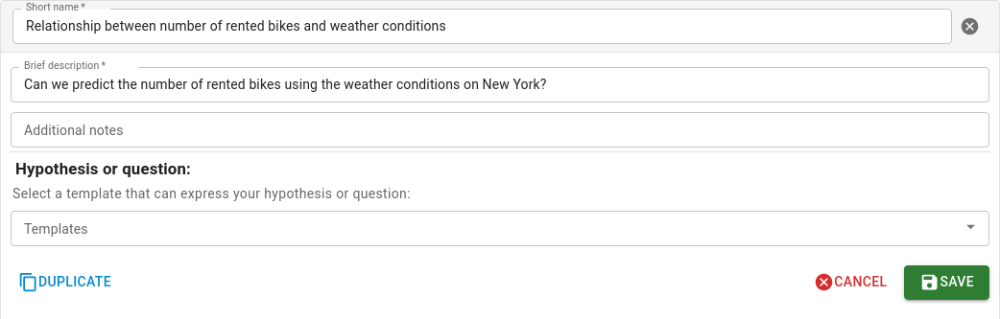

# Specifying A New Hypothesis

A user can start to add a new hypothesis by selecting **Create Hypothesis**.

We are going to create a new question to see what weather variables affect the number bikes rented.

## Selecting a Hypothesis or Question Template

[DISK](https://disk.isi.edu) will show a menu of all the hypothesis and question templates that are defined in the system.  This means that there are Lines of Inquiry that [DISK](https://disk.isi.edu) can use to answer the types of questions that fit those templates.

You can display the questions available by clicking on the **Select Hypothesis Question** drop down list.
Then, select a question from the list.

!!! Info
    The question templates and Lines of Inquiry are created by Advanced Users.

## Creating a Specific Hypothesis

To create a specific hypothesis or question, you need to fill the question template by selecting from the menus shown.

In our bike example, we can create questions about whether the number of bikes rented is associated with the weather variables that we are investigating.

## Documenting a New Hypothesis

You can fill the form to provide the following documentation:

- **Hypothesis name**: The name that you want to give the hypothesis.
- **Hypothesis description**: A brief description of the hypothesis.
- **Hypothesis Notes**: Any notes you want to add that will be attached to the hypothesis.

## Saving Your New Hypothesis

Finally, you can click in the **Save ** button to save the hypothesis and question.

## Next step

In the next step, we will show you how to find a Line of Inquiry to test your new hypothesis.
